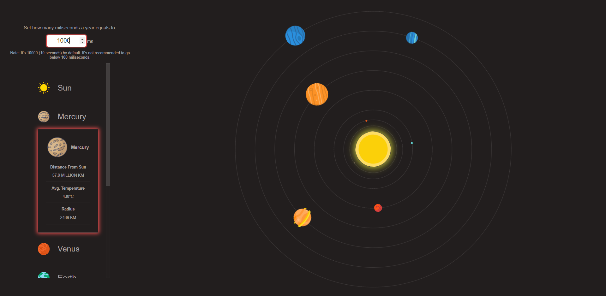

# Solar System

A visualization of the solar system. It's written with React and Typescript. The funnest functionality of the app is changing the speed of time and observe the planets' behaviour.

<div>

</div>

## Installing Solar System

```
git clone https://github.com/absolutezero13/solar-system.git
```

Navigate to solar-system folder and run the command below;


```
 npm install
```
